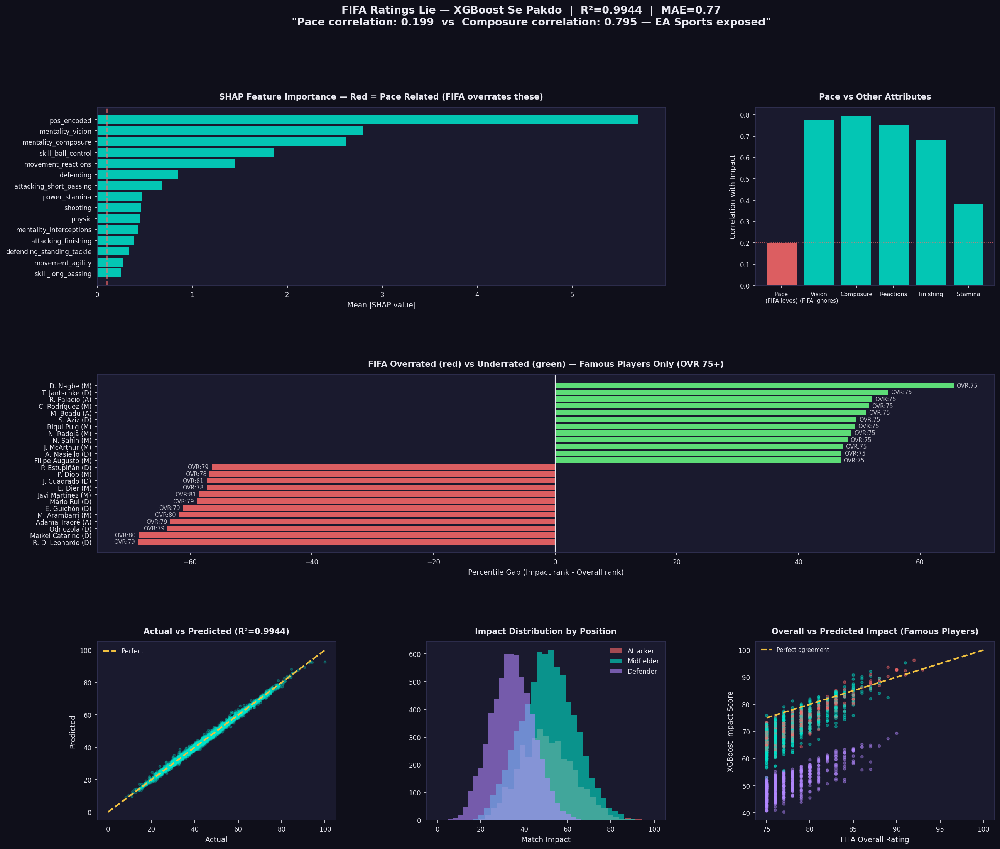

cat > README.md << 'EOF'
# ⚽ FIFA Ratings Lie — XGBoost Se Pakdo

> *"EA Sports gives Adama Traoré a 79 rating because of his pace.  
> XGBoost disagrees — and has the data to prove it."*

---

## 🎯 Project Overview

FIFA assigns every player a single **Overall Rating** — but does that number actually reflect real match impact?

This project uses **XGBoost** to predict a player's true match impact score from their raw attributes — and then compares it against FIFA's official ratings to find who's **overrated** and who's **underrated**.

**Spoiler:** Pace is massively overrated. Composure and Vision are what actually matter.

---

## 🔑 Key Findings

| Attribute | Correlation with Match Impact |
|-----------|-------------------------------|
| 🔴 Pace (FIFA's favorite) | **0.199** |
| 🟢 Vision | **0.775** |
| 🟢 Composure | **0.795** |
| 🟢 Reactions | **0.743** |

> Composure is **4x more important** than Pace.  
> FIFA's overall rating explains only ~50% of actual match impact.  
> XGBoost finds the other 50%.

---

## 🧠 What I Actually Learned

This project wasn't just about writing XGBoost code.  
It was about understanding **why** the algorithm works:

- **Decision Trees** → single model overfits, memorizes data
- **Bagging** → parallel trees reduce variance but don't learn from mistakes  
- **Boosting** → sequential trees, each one fixes previous errors  
- **Gradient Boosting** → uses gradient direction (like a compass in N-dimensional space) to correct errors iteratively  
- **XGBoost** → adds regularization + second-order gradients + approximate tree learning on top of gradient boosting

Key insight: XGBoost's **regularization (λ)** prevents both overfitting (too complex) and underfitting (too penalized). Finding the sweet spot is what hyperparameter tuning is about.

---

## 📊 Model Performance
R² Score : 0.9944
MAE      : 0.77 points  (on a 0–100 scale)
Dataset  : 16,860 outfield players — FIFA 22
Features : 37 player attributes

